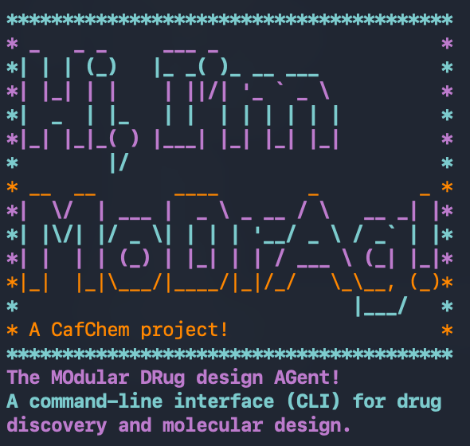

# MoDrAg - The MOdular DRug design AGent

A command-line interface (CLI) tool for drug discovery and molecular design. MoDrAg is an AI-powered agent that leverages multiple specialized tools to analyze molecules, proteins, and support computational drug design workflows.

**A CafChem project!**



## Features

### Molecular Tools
- **Name Node**: Query PubChem to get IUPAC names and synonyms from SMILES strings
- **SMILES Node**: Convert molecule names to SMILES strings
- **Related Node**: Find similar molecules based on SMILES strings
- **Structure Node**: Generate and visualize 3D molecular structures
- **Canonical Node**: Convert SMILES to canonical form

### Property Tools
- **Substitution Node**: Generate novel molecules through strategic substitution and ring growing
- **Lipinski Node**: Calculate drug-like properties (QED, MW, LogP, HBA, HBD, PSA, etc.)
- **Pharmacophore Feature Node**: Analyze and compare pharmacophore features between molecules
- **Similarity Node**: Calculate Tanimoto similarity between reference and query molecules using Morgan fingerprints

### Protein Tools
- **UNIPROT Node**: Search UNIPROT for protein information and IDs
- **List Bioactives Node**: Find bioactive molecules for specific proteins
- **Get Bioactives Node**: Retrieve bioactive molecules from ChEMBL with IC50 values
- **PDB Node**: Query protein sequences and ligands from PDB IDs
- **Find PDB ID Node**: Search for PDB structures matching protein names
- **Target Node**: Find drug targets associated with diseases (Open Targets)
- **Docking Node**: Perform molecular docking using AutoDock Vina
- **Blind Docking Node**: Dock ligands into a receptor of unknown binding site — pockets are detected automatically with a buriedness-based scan and the top-ranked pocket is docked with AutoDock Vina (no search-box center required). Use when the binding site is not known; a proximity fallback switches to a co-crystallized-ligand-adjacent pocket when the best-score pose lands off-target
- **Check Nearby Molecules Node**: Verify a docked pose landed in the correct binding site by comparing it against any co-crystallized ligand in the receptor PDB — the recommended follow-up after blind docking
- **Predict Node**: Predict IC50 values for molecules using LightGBM-trained models

## Installation

### Prerequisites
- Python 3.8+
- Virtual environment (recommended)
- **Ollama API Key** (required) - MoDrAg uses Ollama's cloud LLM service for inference. Set the API key as an environment variable: `export OLLAMA_API_KEY='your-api-key'`

### Dependencies
The project requires the following packages:
- `ollama` - Python client for Ollama LLM service (core dependency)
- `rdkit` - Molecular informatics
- `pubchempy` - PubChem API access
- `pandas` - Data manipulation
- `requests` - HTTP requests
- `chembl-webresource-client` - ChEMBL API access
- `pillow` - Image processing and visualization
- `dockstring` - Molecular docking
- `rcsbapi` - RCSB PDB API access
- `scikit-learn` - Machine learning utilities
- `lightgbm` - Gradient boosting for IC50 prediction
- `openbabel-wheel` - Chemical structure conversion utilities
- `rich` - Rich text and markdown rendering for terminal output

### Setup

1. Clone the repository:
```bash
git clone https://github.com/yourusername/MoDrAg_CLI.git
cd MoDrAg_CLI
```

2. Create and activate a virtual environment:
```bash
python3 -m venv code/modrag-env
source code/modrag-env/bin/activate
```

3. Install dependencies:
```bash
pip install -r requirements.txt
```

Or manually install:
```bash
pip install rdkit pubchempy pandas requests chembl-webresource-client pillow dockstring rcsbapi scikit-learn lightgbm openbabel-wheel rich
```

4. (Optional) Setup shell alias for easy access:
```bash
bash setup_alias.sh
```

This script will automatically:
- Detect your current shell (zsh or bash)
- Find the absolute path to your MoDrAg_CLI directory
- Create a `modrag` alias in your shell config file (`~/.zshrc` for zsh or `~/.bashrc` for bash)
- Source the config file to activate the alias immediately

After this, you can run `modrag` from anywhere in your terminal instead of navigating to the code directory.

## Usage

### Running the CLI

**Important:** Before starting the CLI, set your Ollama API key as an environment variable:
```bash
export OLLAMA_API_KEY='your-api-key'
```
MoDrAg connects to Ollama's cloud LLM service using this key for all inference operations.

**Option 1: With alias (recommended)** - If you ran the setup script:
```bash
modrag
```

**Option 2: Without alias:**
```bash
cd code
python modrag.py
```

The CLI will start with a colorful header and prompt you for commands related to drug discovery tasks.

**Features:**
- Color-coded prompts (light blue for input, purple for responses)
- Response text wrapped to 80 characters per line for readability
- Inference time tracking showing how long each response takes (in minutes)
- Rich markdown rendering for formatted response text
- Automatic image generation and notification system
- Debug output control via `--print` flag

For verbose debugging output with the alias:
```bash
modrag --print
```

Or without the alias:
```bash
python modrag.py --print
```

#### Rich Text Rendering
Responses are rendered using the Rich library with proper markdown formatting. This ensures:
- Proper text wrapping at 80 characters per line
- Markdown syntax support (bold, italics, lists, code blocks)
- Better readability for complex information

#### Image Generation and Notifications
Several tools automatically generate molecular structure images which are saved to `../images/chat_image.png`. When an image is generated during a chat response, a notification appears:
```
Note: Image available at ../images/chat_image.png
```

**Functions that generate images:**
- **Related Node** (`modrag_molecule_functions.py`): Generates grid image of similar molecules
- **Structure Node** (`modrag_molecule_functions.py`): Generates grid image of 3D molecular structures
- **Substitution Node** (`modrag_property_functions.py`): Generates grid image of newly substituted molecules
- **Get Bioactives Node** (`modrag_protein_functions.py`): Generates grid image of bioactive molecules with IC50 values
- **Similarity Node** (`modrag_property_functions.py`): Generates grid image of similar molecules based on Morgan fingerprint comparison

### Running Tests

Basic test suite for molecular and property tools:
```bash
python tool_tests.py
```

Tests a single tool:
```bash
python single_test.py
```

Test the predict node with CHEMBL217:
```bash
python single_test.py  # Includes predict_node test
```

## Project Structure

```
MoDrAg_CLI/
├── code/
│   ├── modrag.py                      # Main CLI application
│   ├── modrag_molecule_functions.py   # Molecular analysis tools
│   ├── modrag_property_functions.py   # Molecular property tools
│   ├── modrag_protein_functions.py    # Protein and docking tools
│   ├── subs_code.py                   # Substitution helper functions
│   ├── tool_tests.py                  # Basic test suite
│   ├── protein_test.py                # Comprehensive test suite for protein functions
│   └── modrag-env/                    # Python virtual environment
├── data/                              # Data files
├── scratch/                           # Temporary files and outputs
└── README.md                          # This file
```

## Tool Examples

### Getting Started with Molecules
```python
from modrag_molecule_functions import *

# Get molecule names from SMILES
names, name_string, _ = name_node(['CCO', 'c1ccccc1'])
print(name_string)

# Get SMILES from names
smiles, smiles_string, _ = smiles_node(['ethanol', 'benzene'])
print(smiles_string)

# Find similar molecules
similar, related_string, images = related_node(['CCO'])
print(related_string)
```

### Analyzing Molecular Properties
```python
from modrag_property_functions import *

# Calculate Lipinski properties
properties, lipinski_string, _ = lipinski_node(['CCO', 'c1ccccc1'])
print(lipinski_string)

# Generate molecular substitutions
new_mols, sub_string, sub_images = substitution_node(['c1ccccc1'])
print(sub_string)
```

### Working with Proteins
```python
from modrag_protein_functions import *

# Search for proteins
ids, protein_string, _ = uniprot_node(['insulin'], human_flag=True)
print(protein_string)

# Find drug targets
targets, target_string, _ = target_node(['cancer'])
print(target_string)

# Dock molecules
scores, docking_string, _ = docking_node(['CCO'], 'ADRB2')
print(docking_string)

# Predict IC50 values
preds, pred_string = predict_node(['CCO', 'c1ccccc1'], 'CHEMBL217')
print(pred_string)
```

### Blind Docking (unknown binding site)
When the receptor's binding site is not known, `blind_dock_agent` detects
putative pockets automatically (a buriedness-based voxel scan) and docks each
SMILES into the top pocket with AutoDock Vina — no search-box center required.
It returns a multi-line report (receptor, pocket centers, per-molecule scores +
pose-SDF paths, best molecule) and writes a rigid-receptor PDBQT plus one pose
SDF per molecule next to the input PDB.

```python
from vina_dock import blind_dock_agent

# Dock a list of ligands into a receptor whose binding site is unknown
report = blind_dock_agent('pdb_files/protein_1ABC.pdb',
                          ['C1=CC=C(C=C1)O', 'CCO'])
print(report)

# Verify the best pose landed in the correct binding site by comparing it
# against any co-crystallized ligand in the receptor PDB (recommended next step)
from modrag_protein_functions import check_nearby_molecules
print(check_nearby_molecules('pdb_files/protein_1ABC.pdb', 'pdb_files/protein_1ABC_0.sdf'))
```

`blind_dock_agent` uses sensible validated defaults (`npockets=1`, exhaustiveness
8, 28 Å box). For a novel receptor where the top pocket may not be the real site,
dock the top-3 pockets by calling `blind_dock(...)` directly from `vina_dock`
with `npockets=3`. See `BLIND_DOCK_INTEGRATION_PLAN.md` for the full parameter
set and validation details.
```

### Session Memory (saving and recalling sessions)
Modrag can save a summary of the current session — every PDB, docking-pose
SDF, and CSV touched during it — to a persistent **vault** at the repo root,
and move the important docking-pose SDFs (`<stem>_<idx>.sdf` pose outputs and
`best_pose.sdf`) into that save so the results are not lost. PDB and CSV files
are named in the summary but left in place (their persistence is untouched).

Two keywords, typed at the Modrag prompt (not sent to the model):

- `memory` (or `save memory` / `remember`) — write this session to the vault.
  Creates a new timestamped folder under `vault/` (append-only; nothing is
  ever overwritten) and appends a one-line entry to `vault/INDEX.md`.
- `recall` — list every saved session (read from `vault/INDEX.md`).
- `recall last` (or `recall 2026-07-19`) — load a saved session's summary into
  the conversation so the model has the prior session's context (files, scores,
  what was tried) for the next question.

```
What can I help with today? > dock CCO against PCSK9_6U2N
...
What else can I help with? > memory
Session memory saved to ../vault/2026-07-19_1714_PCSK9_6U2N (1 pose SDF(s) moved, ...)
What else can I help with? > recall
What else can I help with? > recall last
```

The vault layout:
```
vault/
  INDEX.md                              # one line appended per save
  2026-07-19_1714_PCSK9/
    session_summary.md                  # files list + transcript excerpt
    poses/PCSK9_6U2N_0.sdf              # moved pose outputs
```
See `MEMORY_NODE_PLAN.md` for the design and implementation details.

## Data Sources

- **PubChem**: Molecular structures, names, and properties
- **UNIPROT**: Protein sequences and annotations
- **ChEMBL**: Bioactive compounds and drug targets
- **RCSB PDB**: 3D protein structures
- **Open Targets**: Disease-target associations

## Performance Notes

- Network requests to external APIs may take time (PubChem, ChEMBL, UNIPROT)
- Molecular docking calculations are computationally intensive and use all available CPU cores
- 3D structure generation uses RDKit's ETKDG algorithm
- Image generation requires Pillow for molecule grid visualization

## Output Files

The tools generate several types of output files:

**Images:**
- `../images/chat_image.png` - Centralized location for all molecular structure visualizations (updated each time a molecule image is generated)

**Data Files:**
- `*_uniprot_ids.tsv` - UNIPROT search results
- `*_bioactives.csv` - Bioactive molecule data with IC50 values

**Note:** Image generation functions automatically save to the centralized `chat_image.png` location with a system notification when new images are created during chat interactions.

## Contributing

Contributions are welcome! Please feel free to submit a Pull Request.

### Adding New Tools
For detailed instructions on integrating new tool functions (nodes) into MoDrAg, refer to [NODE_INTEGRATION_SKILLS.md](code/NODE_INTEGRATION_SKILLS.md). This guide covers:
- Preparation and dependency auditing
- Code refactoring and migration patterns
- Chatbot registration and configuration
- Verification and testing procedures

**Note:** The NODE_INTEGRATION_SKILLS.md file is a standardized template that can be passed to any coding agent to ensure consistent tool integration following established project patterns and conventions.

## License

This project is provided as-is for research and educational purposes.

## References

- RDKit: https://www.rdkit.org/
- ChEMBL: https://www.ebi.ac.uk/chembl/
- Open Targets: https://www.opentargets.org/
- RCSB PDB: https://www.rcsb.org/
- AutoDock Vina: https://vina.scripps.edu/

## Contact

For questions or issues, please contact the CafChem project team.

---

**MoDrAg** - Enabling modular, intelligent drug design workflows through AI and computational chemistry.
